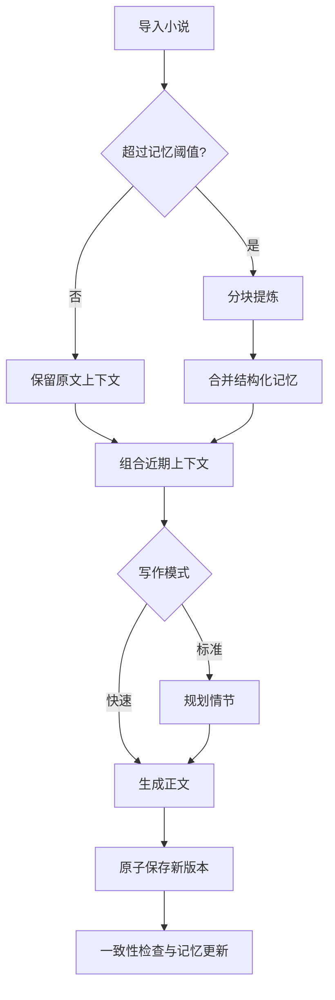

# 长篇小说写作助手

一个面向长篇中文小说的本地 Web 写作工具。它不再依赖“把整本小说一次性发给模型”，而是通过分块总结、结构化长期记忆、近期上下文窗口和版本历史来支持多轮续写。

## 主要功能

- 小说项目持久化：项目、原文、写作要求和生成版本保存在 SQLite 中
- 分层长期记忆：人物、世界规则、时间线、伏笔、当前场景和文风档案
- 长文本分块：超出阈值后分块提炼，再合并为全局记忆
- 上下文预算：组合全局记忆、原文结尾、近期续写和原文风格样例
- 两种写作模式：
  - 快速模式：直接生成正文
  - 标准模式：先规划情节，生成后进行基础一致性检查
- 安全重写：新版本成功生成后才替换当前版本，失败不会丢失原稿
- 版本恢复：每次重写都会保留历史版本，可在网页中恢复
- 项目隔离：项目绑定浏览器签名会话，其他会话不能读取或删除
- 文件导入：支持 UTF-8、GB18030 编码的 `.txt` 和 `.md`
- Markdown 导出：导出原文和全部已接受的续写内容
- 流式输出：使用 SSE 实时显示生成过程
- 响应式写作界面：ChatGPT 风格会话布局、深色模式和移动端侧栏

## 工作流程



## 安装

建议使用 Python 3.10 或更高版本。

```bash
python -m venv .venv
```

Linux/macOS：

```bash
source .venv/bin/activate
pip install -r requirements.txt
```

Windows PowerShell：

```powershell
.\.venv\Scripts\Activate.ps1
pip install -r requirements.txt
```

## 配置模型

模型名称、模型地址和 API Key 支持三种配置方式：

1. 直接填写 `config.json` 中的 `model`、`model_server` 和 `api_key`
2. 在 `config.json` 同目录的 `.env` 中填写变量
3. 设置操作系统或当前进程的环境变量

三种方式可以同时保留，非空值的优先级为：

```text
系统环境变量 > .env > config.json
```

环境变量名称由 `model_env`、`model_server_env` 和 `api_key_env` 指定。某一层未设置或为空时，会自动使用下一层。

直接填写 `config.json` 的示例：

```json
{
  "model": "your-model",
  "model_server": "https://api.example.com/v1",
  "api_key": "your-api-key",
  "model_env": "SUMMARY_MODEL",
  "model_server_env": "SUMMARY_MODEL_SERVER",
  "api_key_env": "SUMMARY_API_KEY"
}
```

`summary_bot` 和 `writing_bot` 都需要完成配置。直接填写真实 Key 时，不要把修改后的 `config.json` 提交到公共仓库。

使用 `.env` 时，复制示例文件并填写真实值：

```bash
cp .env.example .env
```

应用启动时会自动读取与 `config.json` 同目录的 `.env`。该文件已被 `.gitignore` 排除。

也可以通过终端、Docker、systemd 或其他密钥管理工具设置系统环境变量，其优先级最高。

Linux/macOS 示例：

```bash
export NOVEL_SECRET_KEY="随机生成的长字符串"
export SUMMARY_MODEL="Qwen/Qwen3-30B-A3B-Instruct-2507"
export SUMMARY_MODEL_SERVER="https://api.siliconflow.cn/v1"
export SUMMARY_API_KEY="your-summary-key"
export WRITING_MODEL="deepseek/deepseek-chat-v3.1:free"
export WRITING_MODEL_SERVER="https://openrouter.ai/api/v1"
export WRITING_API_KEY="your-writing-key"
```

Windows PowerShell 示例：

```powershell
$env:NOVEL_SECRET_KEY="随机生成的长字符串"
$env:SUMMARY_MODEL="Qwen/Qwen3-30B-A3B-Instruct-2507"
$env:SUMMARY_MODEL_SERVER="https://api.siliconflow.cn/v1"
$env:SUMMARY_API_KEY="your-summary-key"
$env:WRITING_MODEL="deepseek/deepseek-chat-v3.1:free"
$env:WRITING_MODEL_SERVER="https://openrouter.ai/api/v1"
$env:WRITING_API_KEY="your-writing-key"
```

模型名称和生成参数位于 `config.json`。总结模型和写作模型均需提供 OpenAI 兼容接口。

如果没有设置 `NOVEL_SECRET_KEY`，程序会在数据库目录生成一个仅供本机使用的 `data/.secret_key`，该目录已被 `.gitignore` 排除。公开部署时仍应显式设置环境变量。

## 运行

```bash
python app.py
```

默认访问地址：

```text
http://127.0.0.1:5000
```

健康检查：

```text
GET /health
```

## 长篇记忆机制

结构化记忆包含以下字段：

```json
{
  "overview": "全局剧情概述",
  "characters": [],
  "world_rules": [],
  "timeline": [],
  "open_threads": [],
  "current_scene": {},
  "style_profile": {}
}
```

`config.json` 中的重要参数：

| 参数 | 默认值 | 作用 |
|---|---:|---|
| `text_length_threshold` | 100000 | 超过该字符数时建立长期记忆 |
| `summary_chunk_chars` | 24000 | 每个总结分块的近似字符数 |
| `recent_context_chars` | 12000 | 保留的原文近期窗口 |
| `context_char_budget` | 60000 | 单次写作输入的近似字符预算 |
| `style_sample_chars` | 3000 | 用于保持语言风格的原文样例长度 |

字符预算不是模型 Token 的精确换算，但可以防止多轮续写时上下文无限增长。应根据所用模型的上下文长度调整。

## 数据与安全

- SQLite 数据库默认位于 `data/novels.db`
- API Key 仅从环境变量读取，不写入仓库
- Flask 会话密钥来自 `NOVEL_SECRET_KEY` 或本地生成文件
- 不再提供公开的会话调试接口
- 上传扩展名和字数范围同时在服务端校验
- 生成任务按项目加锁，防止重复流式请求同时写入

当前项目隔离适合个人或受信任的内网使用，不等同于完整账户系统。若要公网多用户部署，应增加登录、CSRF 防护、访问频率限制和独立任务队列。

## 测试

安装开发依赖：

```bash
pip install -r requirements-dev.txt
```

运行测试：

```bash
pytest -q
```

测试使用模拟模型，不会调用外部 API，覆盖：

- 首次续写字数参数
- 浏览器会话项目隔离
- 长文本分块与记忆缓存
- 重写失败时保留旧版本
- 重写版本恢复
- 文件与参数校验
- 标准模式规划和一致性检查

## 项目结构

```text
HLNovel_Writing_Agent/
├── app.py
├── config.json
├── novel_app/
│   ├── config.py
│   ├── database.py
│   ├── llm.py
│   ├── memory.py
│   ├── service.py
│   └── web.py
├── prompts/
├── templates/
├── tests/
├── .env.example
├── requirements.txt
└── requirements-dev.txt
```

## 主要接口

| 方法 | 接口 | 作用 |
|---|---|---|
| `POST` | `/process` | 创建小说项目 |
| `GET` | `/stream/<project_id>` | 首次续写 SSE |
| `GET` | `/continue/<project_id>` | 继续续写 SSE |
| `GET` | `/restart/<project_id>` | 重写最后一段 SSE |
| `GET` | `/api/projects` | 列出当前浏览器的项目 |
| `GET` | `/api/projects/<project_id>` | 获取项目和版本 |
| `POST` | `/api/projects/<project_id>/restore/<generation_id>` | 恢复历史版本 |
| `DELETE` | `/api/projects/<project_id>` | 删除项目 |

## 已知边界

- 项目所有权依赖浏览器签名 Cookie，清除 Cookie 或更换密钥后无法从界面找回旧项目
- 关闭 EventSource 可以停止前端接收，但部分模型服务可能仍会继续计算当前请求
- SQLite 适合单机部署；多实例部署应换用共享数据库和任务队列
- 一致性检查是辅助提示，不会自动改写正文
